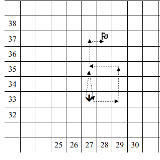

# Robot con sequenza di caselle



## Istruzioni

Il file di input si deve chiamare ```input robot2 v6.txt``` e il percorso consigliato è ```C:\Users\(nome utente variabile)\Desktop\robot2_v6```
<br>
Salvare sempre il file di input prima di eseguire il programma.
<br>
La direzione iniziale e quella finale sul robot verranno chieste dal programma dopo l'avvio. Nel file di input inserire solo la lista di coordinate. 
<br>
Dopo il comando f verrà visualizzato un numero che corrisponde alle volte che il comando si ripete. Se il numero non è presente, sottintendere 1.
Il risultato verrà visualizzato nel file ```output robot2 v6.txt``` nella STESSA cartella del file di input.
